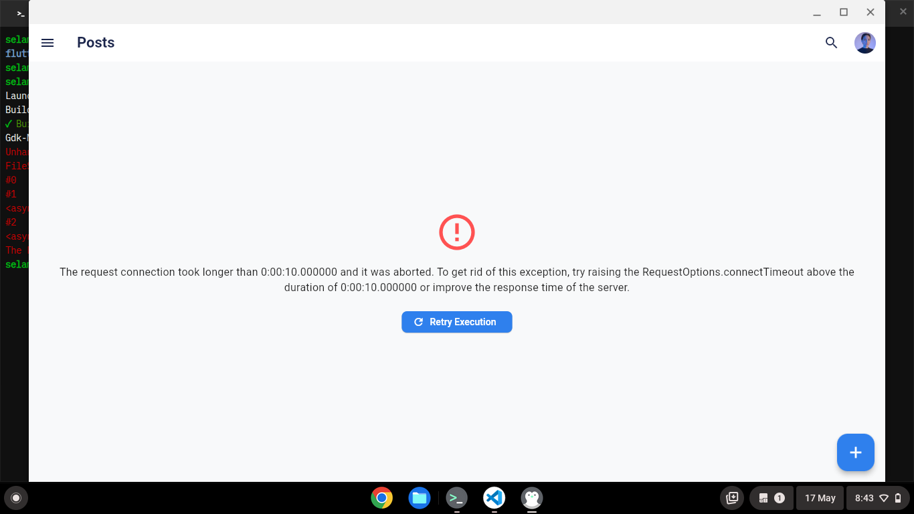

# Posts-Crud-App

A mobile application built with Flutter utilizing Clean Architecture principles and the BLoC state management pattern. The app fetches data dynamically from a remote backend API service and manages application lifecycle states cleanly.

## 👤 Student Information
* **Name:** Selamawit Mulat
* **Section:** 1
* **ID / UGR:** UGR/1033/16
* **GitHub / Username:** [SelamawitMulat](https://github.com/SelamawitMulat)

---

## Key Features & Architecture
* **State Management:** Uses the **BLoC (Business Logic Component)** pattern to decouple presentation states from underlying business logic via strict Event/State streams.
* **Network Handling:** Connects to a centralized remote API layer via a dedicated `PostRemoteDataSource` using a customized `Dio` instance.
* **Dynamic Search & Filtering:** Features an instantaneous text query stream filter allowing users to parse through published records in real-time.

---

## HTTP Server Request & Connection Flow

The application communicates with a remote backend server via asynchronous HTTP network requests. The runtime behavior depends entirely on the status of this connection:

1. **Initiating the Request:** When the application boots initially or a user triggers a data pull event, the BLoC layer invokes the domain use cases (e.g., `FetchPostsUseCase`), dispatching an HTTP request to retrieve the data payload.
2. **Successful Response Processing:** Upon receiving a successful server response, the repository maps the incoming JSON payload into decoupled strong domain Entities (`Post`). The BLoC captures this data packet and emits a populated `PostLoaded` state to display the interactive feed deck.
3. **Graceful Exception Catching:** If the host system detects a network failure or a timeout constraint violation, the core client catches the exception. Instead of crashing, the repository converts this into a standard functional record pattern containing a localized failure string, routing it securely into a specialized `PostError` layout state.

---

## App States Implemented

### 1. Loading State
When fetching posts initially or upon hitting a refresh cycle, the UI non-blockingly renders a responsive placeholder structure to visualize asynchronous loading delays.


### 2. Error State (Network Disconnection)
If the host device loses its active network/WiFi connection, the network call catches a fallback exception. The app displays a dedicated error panel containing an error message along with a blue action button.



### 3. State Continuity (Retry Logic)
When the user clicks the **Retry Execution** button inside the error state:
* **If connection is still broken:** The app safely attempts a fetch, re-catches the network failure, and remains on the error screen.
* **If connection is restored:** The app successfully fetches data from the backend API, instantly clears out the application error status, and brings the user seamlessly to the Home Grid view while fully retaining profile context.

---

## Application Walkthrough Screenshots

### Home & Navigation
* **Home Page (Main Feed):**
  
* **Real-Time Post Search:**
  

### Create, Read, Update, Delete (CRUD) Flows
* **Post Creation Interface:**
  
* **Successful Feed Appending:**
  
* **Post Editing Modal Interface:**
  
* **Saved Feed Modifications:**
  
* **Destructive Warning Dialog:**
  
* **Post Removal Update:**
  

### Profile Management & Personalization
* **Default Profile State:**
  
* **Updated User Preferences:**
  

### Settings & App Profile
* **Theme Preferences (Light Mode):**
  
* **Theme Preferences (Dark Mode):**
  

---

## 🚀 Getting Started

### Prerequisites
* Flutter SDK (Targeting Channel Stable)
* Linux, Android, or iOS host runtime environment

### Installation & Run Cycles
1. Clone the repository and navigate to the project directory:
   ```bash
   cd posts_crud_app

```

2. Reclaim target assets and fetch underlying framework packages:
```bash
flutter clean

```


```bash
flutter pub get

```


3. Run the complete application test suite to verify baseline configurations:
```bash
flutter test

```


4. Build and compile the runtime target environment:
```bash
flutter run
